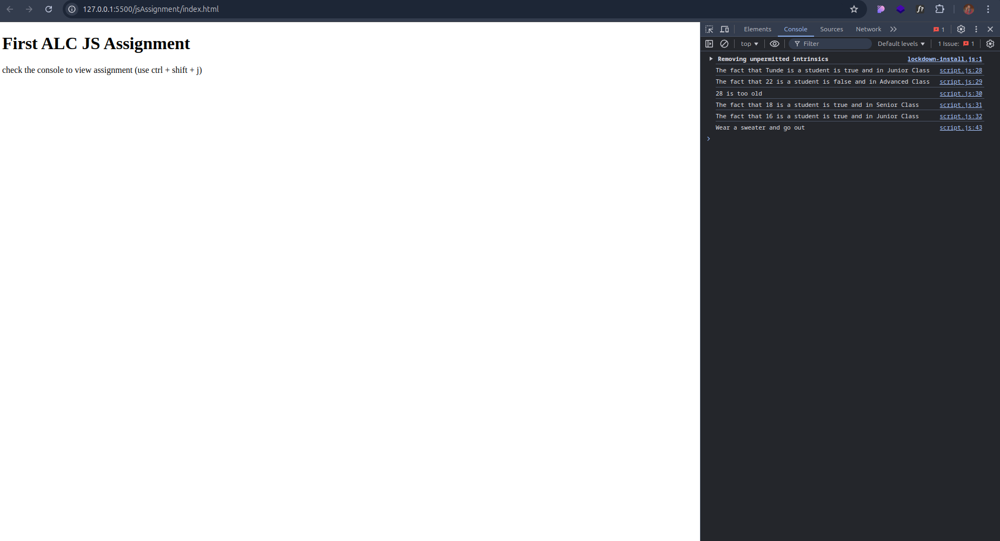

# First ALC JS Assignment

This project is a JavaScript assignment that demonstrates the use of control flow structures, specifically `if-else` and `switch` statements. It is designed for beginners learning JavaScript to practice and apply their understanding of conditional logic.

## Tech Stack

**Client:** HTML, JavaScript

**Server:** Not applicable

## Screenshots

## Lessons Learned

While building this assignment, I learned how to effectively use conditional statements to determine user status based on age and to handle various weather conditions. One of the challenges I faced was ensuring the logic flowed correctly to cover all scenarios. I overcame this by breaking down each condition and testing my code incrementally to ensure accurate outputs.

## Appendix

This assignment consists of two parts:
1. **Assignment 1 (If-Else)**: Determines if a person is a student based on their age and class level.
2. **Assignment 2 (Switch)**: Suggests activities based on the current weather.

